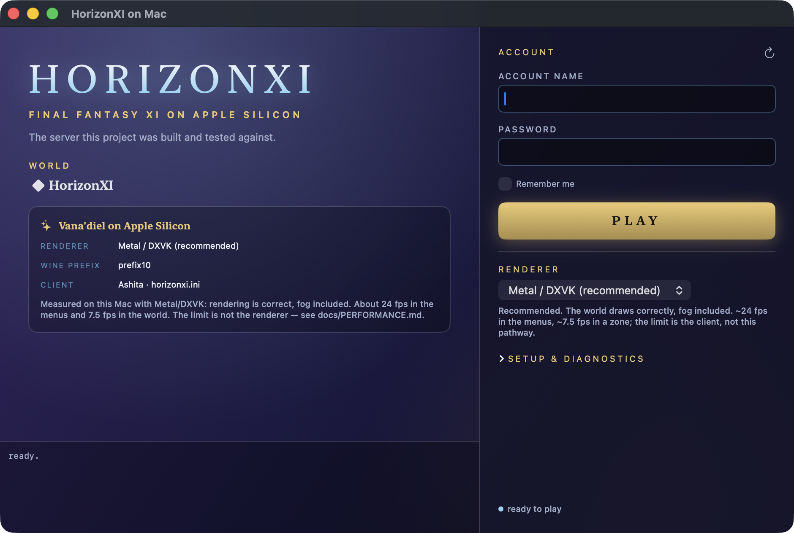
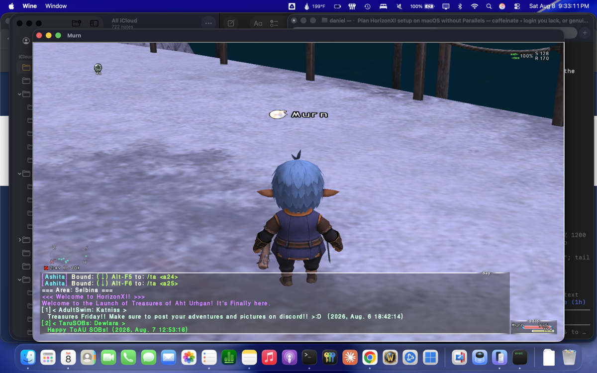
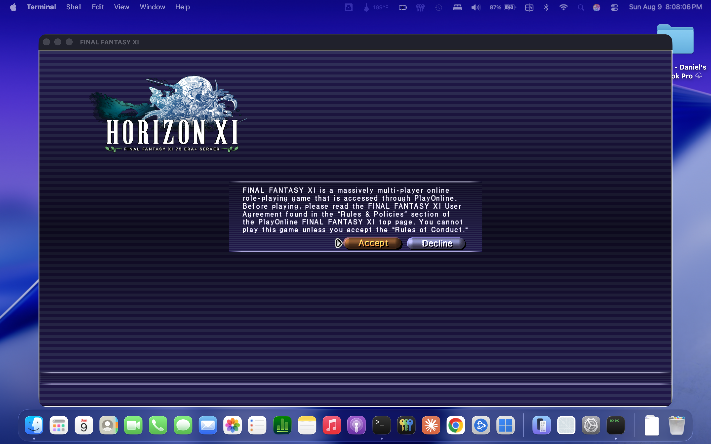

# FFXI on Mac

Running Final Fantasy XI private servers — **HorizonXI**, CatsEyeXI, Eden, and others — natively
on Apple Silicon macOS under Wine, no virtual machine.

> ## 📣 Status — playable, correct, and slow
> The Metal renderer is **correct** — full textures, fog, UI. The frame rate is not: ~24 fps in
> the menus, **~7.5 fps in the world**. As of 2026-08-11 the reason is measured and it is *not*
> the renderer — see [Performance](#performance--where-it-actually-stands). Testers welcome,
> especially on Apple Silicon with more than 8 GB and on Intel Macs.

> ### 2026-08-10 — the launcher, and three renderers measured
>
> 
>
> The launcher now has account name and password, a world dropdown (HorizonXI pinned, the rest
> ordered by community size), and a renderer picker. See [`docs/GOALS.md`](docs/GOALS.md).
>
> On the graphics side, every pathway was measured on the same M1 in the same zone:
>
> | Pathway | fps | CPU | GPU | picture |
> | --- | --- | --- | --- | --- |
> | OpenGL *(default)* | 3.2 in-zone | 185% | 9% | **complete and correct** |
> | wined3d Vulkan | 20.6 | 46% | 95% | models and terrain untextured |
> | d3d8to9 + DXVK | 29.1 | 89% | 17% | menus and UI perfect, 3D world black in-zone |
>
> Two long-standing blockers were root-caused and fixed today — DXVK's black window was
> MoltenVK assigning two uniform buffers to the same Metal binding, cured by
> `MVK_CONFIG_USE_METAL_ARGUMENT_BUFFERS=1`; and `behaviorflags.fpu_preserve = 1` brought back
> most of the 3D pipeline. **Neither fast pathway is playable yet**, so Classic OpenGL is still
> the default and nothing has been announced to the HorizonXI community.
> Full write-up: [`docs/PATHWAYS.md`](docs/PATHWAYS.md).

> **Status: PLAYABLE.** As of 2026-08-08, Final Fantasy XI runs natively on Apple Silicon macOS
> under Wine — logged in, in-world, chat live, Ashita macros bound. As far as a full GitHub sweep
> can tell this is the first time that has happened: every other FFXI-on-a-non-Windows-machine
> project is Linux.
>
> 
>
> Level 75 Ninja standing on the dock in Selbina, no virtual machine involved.

Tested on: MacBook Pro M1, 8GB, macOS 26.5, Wine 10.0 (Sikarugir), HorizonXI client 1.9.0,
Ashita 4.3.1.2.

## Quick start

```sh
./scripts/install.sh /path/to/wrapper.app        # configure the prefix
"/path/to/Play HorizonXI.command"                # launch
```

Assumes the HorizonXI client is already extracted to `<prefix>/drive_c/HorizonXI` (~27GB).

## Why this repo exists

A GitHub sweep — ~318 FFXI-related repos, the Windower / AshitaXI / HorizonFFXI / LandSandBoat /
EdenServer / CatsEyeXI org listings, and code search for `FFXiMain.dll`, `horizon-loader.exe`,
`xiloader`+`WINEPREFIX` — turns up **zero** prior attempts to run FFXI on macOS:

- `Windower/Lumoria` — Windower's official FFXI installer/launcher. Vala + Flatpak, **Linux only**
- <https://gitlab.com/MattyGWS/HorizonXI-Linux-Installation> — the wiki's official pointer
- `sheik/horizonxi-linux`, `sarca571ca/horizonxi-lutris`, `TeamLinux01/HorizonXI-on-Deck`
- `jondwillis/kuluu-ffxi` — a Rust/Bevy client rebuild *on* macOS, but it drives the real client
  inside Parallels

The macOS-specific problems below are not covered by any of them.

## What was actually wrong

The symptom was a silent exit: login succeeded, the server connected, every DAT archive loaded,
and then the process closed in ~2s with no error, no crash dump and exit code 0. It never created
a window and never made a single d3d8 call, so it looked like a graphics problem. It was not.

**The PlayOnline registry layout is counter-intuitive, and every reasonable guess at it is wrong.**
HorizonXI ships the correct layout in `SquareEnix/Switch_Horizon.bat`:

```
HKLM\SOFTWARE\WOW6432Node\PlayOnlineUS\InstallFolder
    0001 = ...\SquareEnix\FINAL FANTASY XI      ← the GAME dir, not PlayOnlineViewer
    1000 = ...\SquareEnix\PlayOnlineViewer      ← POL goes in 1000
HKLM\SOFTWARE\WOW6432Node\PlayOnlineUS\Interface
    0001 = "0"                                   ← a string, not an empty key
```

Putting `PlayOnlineViewer` in `0001` — the obvious reading, and what the prefix had — makes
`FFXiMain.dll` stop loading entirely. Combined with writing to the wrong registry view (below)
and launching xiloader directly instead of through Ashita, the game aborted inside its own init
before window setup.

## Fixes this project found (macOS-specific, not in any Linux guide)

1. **The wrapper's `wineserver` cannot find its own dylibs.** Its rpath is `@loader_path/../../`,
   resolving to `SharedSupport/`, but the dylibs ship in `Contents/Frameworks/`. The usual
   workaround is exporting `DYLD_FALLBACK_LIBRARY_PATH`, which is a trap — see #2. The correct
   fix is to symlink the frameworks into the path the binary actually searches:
   [`scripts/fix-wine-rpath.sh`](scripts/fix-wine-rpath.sh).
2. **`nohup` and `/bin/sh` are SIP-protected and strip every `DYLD_*` variable.** Any launcher
   built on `DYLD_FALLBACK_LIBRARY_PATH` breaks the moment it is backgrounded or wrapped in a
   shell script — silently. `winetricks` is `#!/bin/sh` and hits exactly this. Fix #1 removes the
   dependency on the variable entirely.
3. **`reg.exe` writes the 64-bit registry view.** The 32-bit game reads
   `HKLM\SOFTWARE\Wow6432Node\...`, so a prefix configured with plain `wine reg add` leaves the
   game seeing nothing at all. Use `C:\windows\syswow64\reg.exe` — or write both views.
4. **FFXI is three COM in-proc servers, not one** — `FFXi.FFXiEntry`, `FFXiMain.GameMain`,
   `POLCore.POLCoreCom`. `regsvr32` **needs `/s`**: without it, `FFXi.dll`'s `DllRegisterServer`
   opens a GUI dialog, and synthetic input cannot reach wine windows, so it hangs forever with
   nothing to click. [`scripts/export-ffxi-com.py`](scripts/export-ffxi-com.py) lifts the
   registration out of a working prefix if you need to clone it.
5. **Launch through `Ashita-cli.exe`, not `xiloader` directly.** With the correct registry but
   launched xiloader-direct, the game still exits silently.
6. **Wine resolves a relative exe name against `C:\windows\system32`, not the cwd.** Always pass
   the absolute `C:\...` path.
7. **A wine prefix cannot live on exFAT**, and on a removable volume every process touching it
   needs the TCC "Removable Volumes" grant — which `launchd`-spawned jobs never have. Run it from
   a terminal with Full Disk Access.
8. **Synthetic input (CGEvent) does not reach wine-hosted windows.** Any step needing a real
   keypress or click cannot be automated — prefer silent/CLI equivalents everywhere else.

## Things that look like the bug and are not

Recorded so nobody re-treads them — all tested and disproven, with the instrumented evidence in
[`docs/FINDINGS.md`](docs/FINDINGS.md):

Ashita and its addons · `gdiplus` · sound init · the `patch.ver` version check · missing
`ROM11`–`ROM13` (not in the client's own `file.txt` manifest) · the Wine version (9.0 CX24 and
10.0 Sikarugir behave identically) · new-WoW64 vs a true 32-bit prefix · DAT corruption (170
size mismatches vs `file.txt` are intentional Horizon overrides, byte-identical to a working
Windows install) · `dgVoodoo2` and the `winefix` addon, which the Linux guides recommend —
`winefix` ships with the client and its own description says it only fixes a micro-stutter.

## The launcher

`FFXI-on-Mac.app` — account login (password in the Keychain, written into Ashita's boot
profile at launch and never into this repo), a preflight check for every precondition that has
silently broken before, one-click prefix repair, graphics settings, and a live log.

```sh
./app/bundle.sh          # build the .app (no Xcode needed — Command Line Tools only)
./scripts/package.sh     # build dist/FFXI-on-Mac-<version>.dmg
```



## Performance — where it actually stands

Rendering is **correct** on Metal: D3D8 → d3d8to9 → DXVK 1.10.3 → MoltenVK, full textures, fog,
UI. The frame rate is not there.

| scene | fps |
| --- | --- |
| rules-of-conduct / title screens | ~24 |
| character select (~1841 draws) | ~12 |
| in-world, Mog House (~850 draws) | **~7.5** |

Fewer draws, worse frame rate — which is the first sign that the usual explanations are wrong.
This session instrumented the whole stack to find out where the time goes, and the answer
overturned the previous model:

- **Draw calls cost 1.9 µs each, about 3% of a frame.** Discarding *every* draw
  (`DXVK_SKIP_DRAWS=1`) makes the frame rate go **down**, not up. Draw-call batching, instancing
  and render-pass merging are all inside a slice of the frame too small to matter.
- **`Present` costs 0.05 ms.** Everything inside DXVK adds up to a fifth of the frame in the
  menus and almost nothing in the world.
- **In the world the client stalls ~120 ms per frame at 13% CPU** — one pause per frame, outside
  every D3D entry point, doing nothing. That single stall is the whole gap between 7.5 fps and a
  playable game.

Full measurements and method: [`docs/PERFORMANCE.md`](docs/PERFORMANCE.md). The stall is written
up as a bug report with a dozen hypotheses already eliminated and the strongest lead identified
(FFXI's texture path through d3d8to9): [`docs/INWORLD-STALL.md`](docs/INWORLD-STALL.md). It is
the highest-value thing left in this project by a wide margin.

The instrumentation is reusable: our `d3d9.dll` carries six probes behind environment variables,
and [`scripts/harness/`](scripts/harness) runs a whole configuration — launch, navigate, sample,
screenshot, kill — from one command.

## Known limitations

- **~7.5 fps in the world.** Cause identified, not yet fixed. See above.
- **No Ashita plugin or addon loads.** Ashita.dll here is plugin interface 4.16 and every
  bundled plugin is 4.15, so the plugin manager rejects all of them — including the `Addons`
  Lua host, so no Lua addon loads either. Affects gameplay, not just benchmarks.
- Tested on exactly one machine: M1 MacBook Pro, 8 GB, macOS 26.5.

## Roadmap

- [x] Login and server connection
- [x] Ashita injection, POL plugins, DAT overlays, macro import from a Windows install
- [x] `install.sh` — bare prefix to running game, no GUI
- [x] `FFXI-on-Mac.app` — launcher with preflight, repair, account login, world picker
- [x] `package.sh` — distributable disk image, signed and notarised
- [x] **Renderer on Metal, rendering correctly** — fog fix + Metal feature relaxations
- [x] **Find out what actually limits the frame rate** — it is not the renderer
- [ ] **Fix the in-world stall** — [`docs/INWORLD-STALL.md`](docs/INWORLD-STALL.md)
- [ ] Bundle the dependencies for non-technical users — unblocked, plan in
      [`docs/BUNDLING.md`](docs/BUNDLING.md)
- [ ] Fix the Ashita 4.15/4.16 plugin mismatch
- [ ] Upstream the two DXVK fixes — [`docs/UPSTREAM.md`](docs/UPSTREAM.md)
- [ ] Announcement / macOS entry on the HorizonXI wiki — draft in
      [`docs/ANNOUNCEMENT.md`](docs/ANNOUNCEMENT.md)

## Licence

GPL-3.0, matching `hxiloader` and `XIV-on-Mac`.

Not affiliated with HorizonXI, Square Enix, or the Ashita project.
