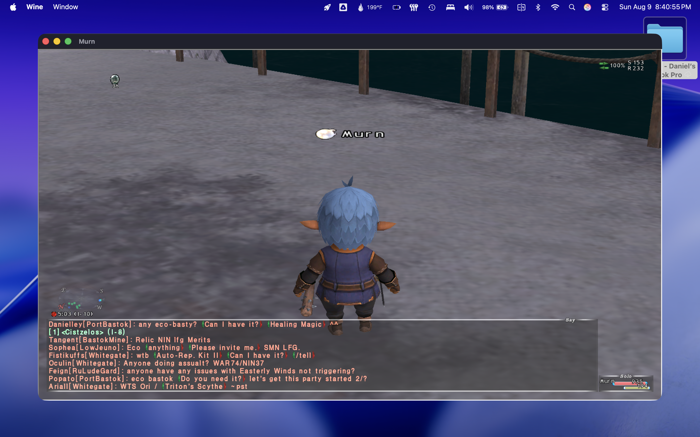

# FINAL FANTASY XI runs natively on Apple Silicon macOS — open beta

*2026-08-09*

HorizonXI runs on an M1 MacBook Pro under Wine. No virtual machine, no Parallels, no Windows
licence. The character logs in, the world loads, Ashita injects, chat is live.

*Murn — Tarutaru Ninja 75, on the dock in Selbina, on a Mac.*

As far as a full GitHub sweep can tell, this is the first time FFXI has run on macOS this way.
Every other FFXI-on-a-non-Windows-machine project — `Windower/Lumoria`, MattyGWS' guide,
`sheik/horizonxi-linux`, `TeamLinux01/HorizonXI-on-Deck` — is Linux only.

## What you get

- **`HorizonXI-on-Mac.app`** — a launcher with account login, a preflight check for every part of
  the setup that can silently break, one-click prefix repair, graphics settings and a live log.
  Your password goes in the macOS Keychain, never into a config file this project ships.
- **`scripts/install.sh`** — bare Wine prefix to running game, no GUI needed.
- **`docs/FINDINGS.md`** — every dead end with the instrumented evidence behind it, so nobody has
  to re-tread them.

## What was actually wrong

The PlayOnline registry layout is counter-intuitive, and every reasonable guess at it is wrong.
`InstallFolder\0001` must be the **FINAL FANTASY XI** directory, not `PlayOnlineViewer`; POL goes
in `1000`. It has to be written to the **32-bit** registry view, and the three FFXI COM servers
must be registered with `regsvr32 /s` — without `/s` it hangs on a dialog no synthetic click can
reach. HorizonXI ships the correct layout in `SquareEnix/Switch_Horizon.bat`, which is where it
was eventually found. This may be useful to the Linux side too.

## Read this before you try it

**It is slow, and the fix is one step away.** Wine's builtin Direct3D 8 runs through OpenGL and is
translated on a single CPU thread — **148% CPU with the GPU at 6%**. The GPU is starved, not
unused, so there is no "enable the GPU" switch; the answer is removing translation layers.

D3D8 → [d3d8to9](https://github.com/crosire/d3d8to9) → DXVK 1.10.3 → MoltenVK now gets all the way
to a **live Vulkan device**. Three blockers had to fall first, and each failed silently on its own:

- **`Ashita.dll` imports `d3d8.dll` itself.** A native D3D8 shim must sit on *Ashita's* search
  path, not just the game's. Miss that and you get `[E] Injection failed!`, which looks exactly
  like the renderer breaking Ashita and is nothing of the sort.
- **This wine build ships zero `api-ms-win-crt-*` DLLs**, and every renderer DLL imports a dozen
  of them, so none of them can load in a stock prefix. Working 32-bit copies are sitting in the
  wrapper's own `wine.cx32bak/lib32on64/wine/`.
- **The default MoltenVK reports Vulkan 1.1** and DXVK cannot create a device on it
  (`DxvkAdapter: Failed to create device`, `timelineSemaphore : 0`). The `moltenvkcx` build
  shipped alongside it reports 1.2 and works.

**And then it draws nothing.** The window opens, the device is live, the GPU shows 24–32%
utilization, CPU drops to 11–16% — and the window stays black for as long as you care to watch.
That is not a speedup; a renderer that never presents a frame is also cheap. **Getting DXVK's
swapchain onto a wine window on macOS is the one remaining step, and it is where help would make
the most difference.** `HXI_METAL=1 ./scripts/install.sh …` sets the whole thing up if you want to
attack it; it is off by default and the shipped configuration uses the working OpenGL path.

Also worth knowing: **DXVK 2.x/3.x cannot work on Apple Silicon.** It requires Vulkan 1.3 and
`geometryShader`; Metal has no geometry shaders, so MoltenVK can never expose one. DXVK 3.0.2
loads, finds the M1, and rejects it. Use 1.10.3 from doitsujin's releases — Gcenx's macOS repack
of that same version omits `d3d9.dll`.

Other known limitations:

- Five Ashita plugins (`addons`, `screenshot`, `Nameplate`, `PacketFlow`, `thirdparty`) fail to
  load — built against plugin interface 4.15, this Ashita expects 4.16.
- The `.dmg` is unsigned and un-notarised, so Gatekeeper blocks it on other Macs.
- The client itself (~27GB) and the Wine wrapper are not bundled. You supply both;
  `scripts/Install FFXI on Mac.command` walks you through the rest.
- Only **HorizonXI** is tested. The launcher has buttons for Eden, CatsEyeXI and Nasomi, but
  their login hosts are left blank on purpose rather than guessed at — fill them in from each
  server's own installer.
- Tested on exactly one machine: M1 MacBook Pro, 8GB, macOS 26.5.

## Testers wanted

Especially Apple Silicon Macs with more than 8GB, and Intel Macs, where nobody has tried this at
all. Open an issue with your machine, macOS version, and how long a zone load takes.

Not affiliated with HorizonXI, Square Enix, or the Ashita project.
