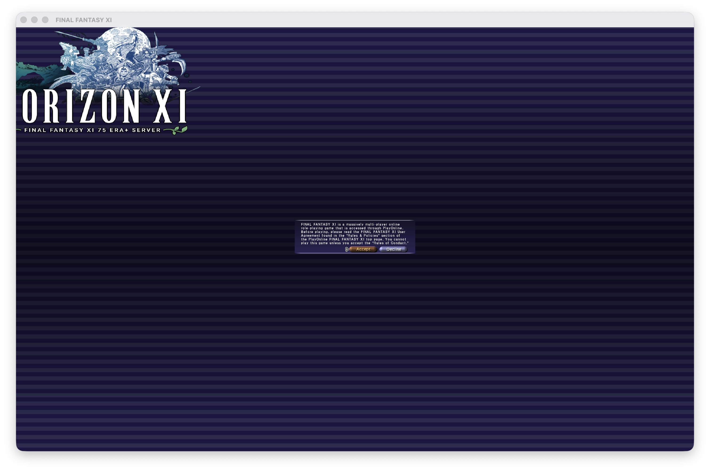
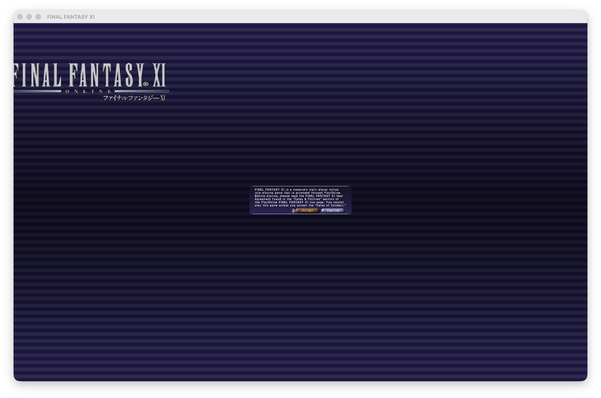
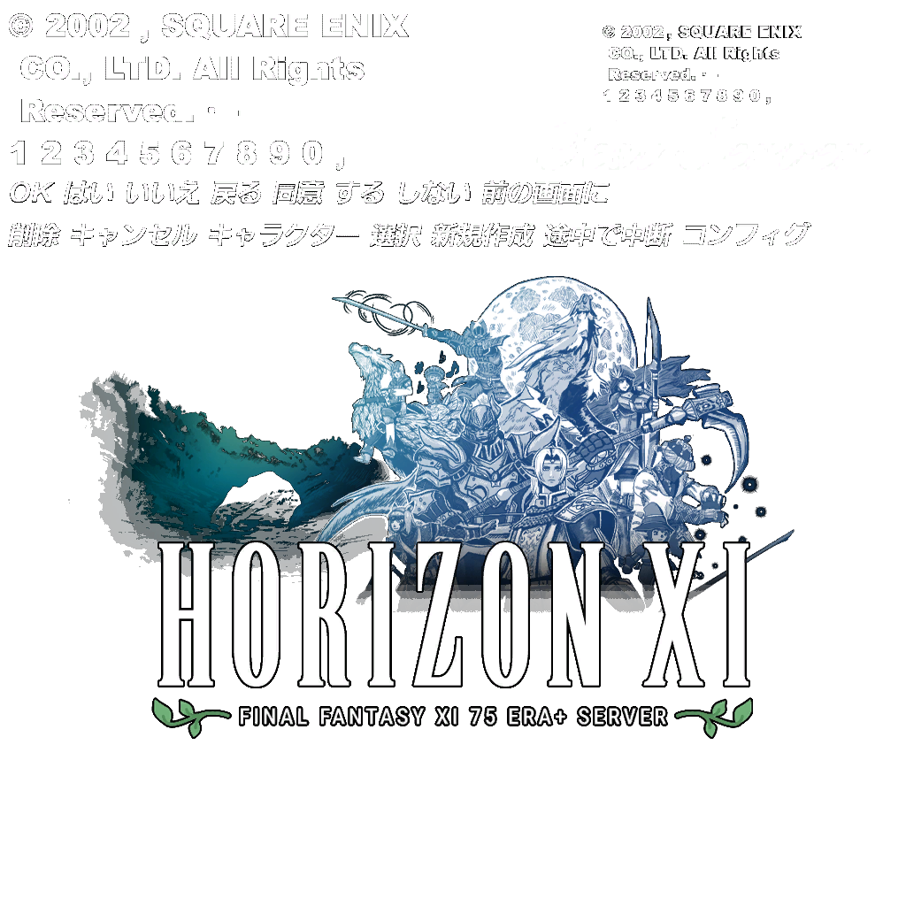

# The HorizonXI branding, and how to get the stock title screen back

Rewritten 2026-08-14. **Solved.** An earlier version of this file recorded a diagnosis that was
partly wrong; the wrong parts are kept below, because two of them are traps worth not falling into
twice.

Daniel plays his own **LandSandBoat** world through this install, and the client still showed the
HorizonXI logo on the title screen. It should show the stock Square Enix one — LSB ships no
branding of its own, so "the LandSandBoat look" *is* stock.

| before | after |
| --- | --- |
|  |  |

## Where it lives

One texture: entry **`menu/titlwin`** in **`ROM/119/50.dat`**, 1024×1024, DXT3.

Note what else is in that texture. The top ~296 rows are **not branding** — they are the shared
menu wordlist (`OK`, `はい`, `いいえ`, `戻る`, `キャンセル`, `新規作成`, `コンフィグ` …) and the
copyright line. Replacing the whole texture, which is the obvious move, deletes the words the
menus are drawn from. `brandpatch.py` only rewrites rows below that line.

## What did not work, so nobody repeats it

- **Dropping HorizonXI's XIPivot overlays.** `pivot.ini` was rewritten to load only `remapster`
  and `xiview`, and Ashita's log confirms only those two loaded. The logo was still on screen. The
  branding is in the base client data HorizonXI's installer wrote, not layered on top of it.
- **Assuming it is `menu/xilogo`.** There are two copies of that entry (`ROM/0/2.DAT` and
  `ROM/118/112.DAT`) and **both are the untouched stock logo**. They are the source of the
  replacement, not the problem.
- **Timing it from XIPivot's `fopen` log.** `debug_log=true` does log every DAT the client opens,
  but the client opens all of them in a single burst at startup, seconds before it draws anything.
  Nothing in the timing separates the title screen from anything else.
- **Elimination by blanking candidate DATs.** An all-zero DAT of the right length hangs the client
  before it renders, so "the logo disappeared" and "the game did not start" are the same
  observation. That probe is archived at `archive/brandprobe.py` rather than deleted, because the
  overlay-staging and pivot.ini-restore parts of it are sound and reusable.
- **`ROM/0/4–7.dat`.** An earlier session named these as the menu and title resources because they
  are lowercase among uppercase siblings and post-date the base install. They *are* modified, but
  they contain no image entries at all. Modified is not the same as relevant.

## What did work

1. `scripts/datimg.py` scans a DAT for the image-entry signature documented in
   [XiyanFlowC/FFXIDat](https://github.com/XiyanFlowC/FFXIDat) (`docs/FILE_FORMATS.md`,
   `FFXIDat/Image.h`) and can decode and export the entries it finds. One gotcha: the DXT fourCC
   is stored **byte-reversed** — `3TXD` on disk means DXT3 — and without that every decode
   silently produces nothing.
2. Restrict to the 2,801 DATs whose mtime post-dates the 2023-08-15 base install (1,608 from
   HorizonXI's 2023-09-27 install, 1,192 from their 2026-08-08 update), and dump every image in a
   menu-ish group. `menu/titlwin` is the only branded image in the whole set.

## The fix

`scripts/brandpatch.py` builds an XIPivot overlay called `stockbrand` containing one patched copy
of `ROM/119/50.dat`:

- rows below 296 cleared to transparent;
- the client's own stock `menu/xilogo` artwork composited into the exact bounding box the
  HorizonXI artwork occupied — measured from the texture, not guessed;
- re-encoded to DXT3 at **identical byte length**, so the entry's declared `textureSize` still
  matches.

Nothing under `SquareEnix/` is written to. The whole change is one line in `pivot.ini`, and
`stockbrand` must be listed **first** — XIPivot resolves overlays in order and `horizonoverrides`
would otherwise win.

The launcher does this automatically: `Branding.swift` enables the overlay for every server except
HorizonXI, on the reasoning that playing on HorizonXI showing HorizonXI's branding is correct.

    ./scripts/brandpatch.py --preview /tmp/preview.png     # look before committing
    ./scripts/brandpatch.py --out-overlay stockbrand       # write the overlay

## One quirk, which is pre-existing

At 1440 px wide the game draws this texture with its left ~175 pixels off the left edge of the
window. **HorizonXI's own logo was clipped by it too** — look closely at the before screenshot and
it reads "ORIZON XI", with the H cut in half. So placing the replacement exactly where theirs sat
reproduces the defect faithfully; `brandpatch.py` nudges it 130 px right instead, which is why the
after screenshot shows the whole logo. Whether the clip exists at true 4K fullscreen has not been
tested — the verification runs were windowed.
